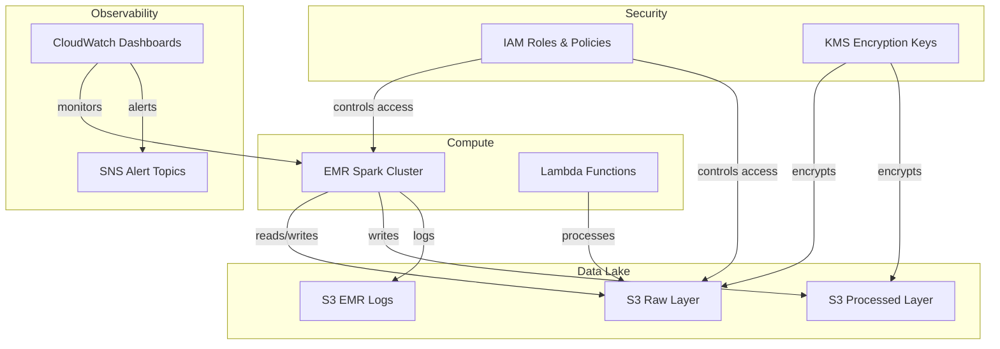

# aws-data-platform-iac

Terraform modules for provisioning and managing AWS data platform infrastructure — EMR clusters, S3 data lakes, IAM roles, Lambda functions, and CloudWatch observability. Built from production patterns used at scale in regulated financial environments.

Fully runnable locally via **LocalStack** — no AWS account required.

## Architecture



## Modules

| Module | Description |
|--------|-------------|
| [`modules/emr`](./modules/emr) | EMR cluster with Spark config, auto-scaling, CloudWatch alarms |
| [`modules/s3`](./modules/s3) | S3 bucket with encryption, versioning, lifecycle policies, replication |
| [`modules/iam`](./modules/iam) | IAM roles with trust policies and cross-account support |
| [`modules/lambda`](./modules/lambda) | Lambda function with execution role, VPC config, log group |
| [`modules/cloudwatch`](./modules/cloudwatch) | Dashboards, metric alarms, log metric filters |

## Quick Start (LocalStack)

### Prerequisites
- Docker & Docker Compose
- Terraform >= 1.5
- Python 3.12+
- AWS CLI

### 1. Start LocalStack
```bash
docker-compose up -d
# Wait for healthy: docker-compose ps
```

### 2. Configure AWS CLI for LocalStack
```bash
aws configure set aws_access_key_id test
aws configure set aws_secret_access_key test
aws configure set region us-east-1
```

### 3. Deploy dev environment
```bash
cd environments/dev
terraform init
terraform plan
terraform apply
```

### 4. Run S3 lifecycle audit
```bash
pip install boto3

# Audit — report only
python scripts/s3_lifecycle_audit.py --endpoint-url http://localhost:4566

# Dry run — show what would be applied
python scripts/s3_lifecycle_audit.py --endpoint-url http://localhost:4566 --dry-run

# Apply default lifecycle policies to non-compliant buckets
python scripts/s3_lifecycle_audit.py --endpoint-url http://localhost:4566 --apply
```

### 5. Run EMR rehydration
```bash
chmod +x scripts/emr_rehydration.sh
./scripts/emr_rehydration.sh data-platform-spark dev
```

## Deploy to Real AWS

1. Remove `use_localstack = true` from `terraform.tfvars`
2. Set up AWS credentials: `aws configure` or use IAM role
3. Update `subnet_id`, `master_sg_id`, `slave_sg_id` with real VPC values
4. Run `terraform apply`

## CI/CD

GitHub Actions runs on every push and PR:
- `terraform fmt` check across all modules
- `terraform validate` per module
- `tfsec` security scan
- LocalStack integration test for S3 lifecycle audit

## Scripts

| Script | Purpose |
|--------|---------|
| `scripts/emr_rehydration.sh` | Terminates existing cluster, re-provisions via Terraform, validates health |
| `scripts/s3_lifecycle_audit.py` | Scans all buckets for missing lifecycle policies, optionally remediates |
